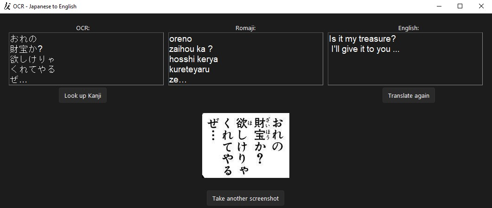

# OCR Japanese English

As a lover of the Japanese culture and student of the Japanese language, I often try to read things in Japanese. And, while textbooks on the browser are easy to read due to amazing existing browser extensions, that's not the case when it's outside the browser or it's an image, like a manga.

So with this in mind, I created a simple software that crops a part of the screen and do an OCR on it.

## Requirements

Windows 10 (for now), Python 3.x, Tesseract 4.0 with [Japanese Vertical Trained Data](https://github.com/tesseract-ocr/tessdata/blob/master/jpn_vert.traineddata)
## Usage

Run the script with `pythonw main.py` to run on background

Press the `PrintScreen` key (can be customized) on the keyboard to start the capture process

Place the mouse cursor at starting point of where you want to crop and press `CTRL-Left` key (can be customized)

Place the mouse at the ending point and press again the `CTRL-Left` key, forming a rectangle.

A window should open with the OCR, the Romaji version of the OCR and an English Translation

You can change the OCR text and try to translate it again.

Or you can look up the whole OCR string to understand better the kanji
## Installation
`TODO `

## Next Steps
`TODO`